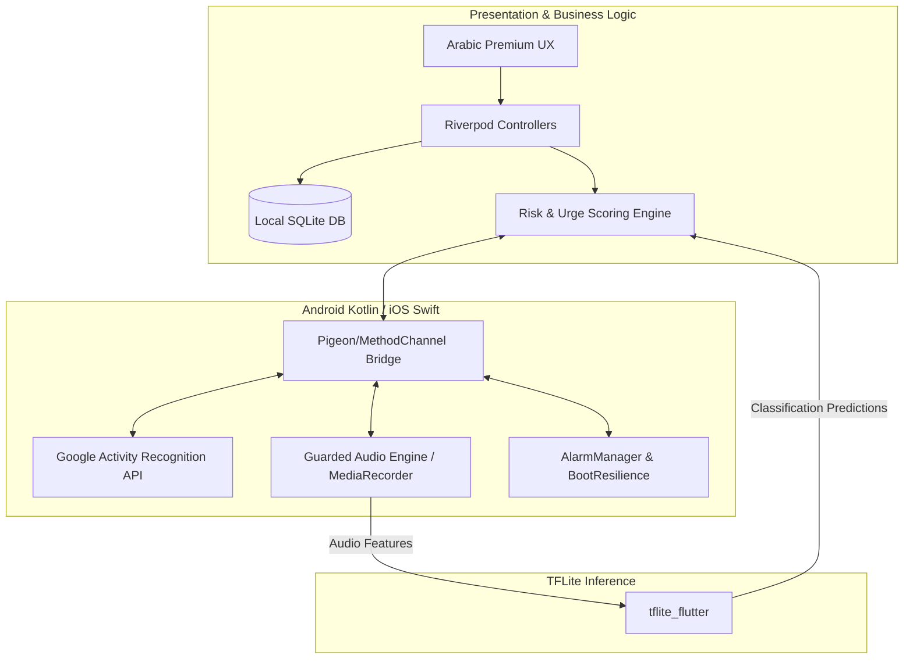

# 🫁 Nafas OS

[](https://flutter.dev)
[](https://dart.dev)
[](LICENSE)
[](#)

> **"It reaches the urge before the cigarette."**

**Nafas OS** is an innovative, local-first, intervention-driven anti-smoking operating layer. Unlike generic quit counters, **Nafas OS** is a predictive context engine focused on modeling the user's pre-smoking signatures and interrupting the craving window before the smoking act actually happens.

---

## 🎯 Product Thesis & Core Philosophy

Smoking is rarely random. It is preceded by a recognizable behavioral signature consisting of:
* A specific time window or stationary duration.
* A physical location or context.
* A device usage pattern (e.g., social media scrolling or digital drift).
* A bodily state (stress, heart rate, breathing, coughs).
* A ritual expectation (post-meal, driving, coffee).

**Nafas OS** detects this signature and breaks the loop:
$$\text{Trigger} \rightarrow \text{Urge} \rightarrow \text{Act} \rightarrow \text{Temporary Relief}$$

It doesn't fight the cigarette after it is lit—it breaks the crucial minutes and seconds leading up to ignition.

### Product Pillars
1. **Prediction:** Computes real-time context risk scores.
2. **Intervention:** Reaches the user quickly with tailored calming rescue actions.
3. **Replacement:** Offers sensory and behavioral ritual replacements (breathing, tap patterns, shield-holding).
4. **Reflection:** Helps the user understand triggers and historical patterns without guilt.
5. **Adaptation:** Customizes the engine's model based on user logs and retraining.

---

## ✨ Key Features

| Feature | Description |
| :--- | :--- |
| 🤖 **On-Device TFLite ML** | Runs a local TensorFlow Lite model (`guarded_audio_classifier.tflite`) directly on-device to classify breathing patterns, restlessness, coughs, and lighter sparks. |
| 📈 **Rules-First Risk Engine** | Employs a live scoring engine based on triggers, stress, digital drift, and activity transitions to predict smoking probability. |
| 🗣️ **Arabic-First Premium UX** | Features a premium localized design system with tailored copywriting spanning Onboarding, Home, Rescue, Timeline, Insights, Lab, and Settings. |
| 🔌 **Native Platform Bridges** | Deep native Android bridges for context gathering, activity recognition (Google Activity Recognition API), and Bluetooth audio routing. |
| 💾 **Offline SQLite Storage** | Local-first storage tracking profile baselines, smoke events, craving triggers, symptom logs, and context snapshots. |
| 🛡️ **Samsung Reboot Hardening** | Diagnostics and exact-alarm rescheduling via native `AlarmManager` + `BOOT_COMPLETED` checks to remain active after device restarts. |
| 📊 **Advanced Insights & Retraining** | Interactive timeline charts and lab settings for exporting logged audio training samples to retrain the TFLite model. |

---

## 🏗️ Architecture & Technical Stack

Nafas OS uses a **feature-first modular monolith** architecture structured around a Flutter UI shell with deep native platform capability engines.



* **Frontend Framework:** Flutter & Dart
* **State Management:** Riverpod 3.0
* **Routing:** GoRouter
* **Database:** SQLite (`sqflite` for cross-platform local-first storage)
* **On-Device ML:** TensorFlow Lite (`tflite_flutter`)
* **Local Notifications:** `flutter_local_notifications`

---

## 📂 Documentation Map & Index

The development and product specifications are fully documented under the [`docs/`](docs/) directory:

1. **[Product Vision](docs/01_product_vision.md):** Taglines, thesis, pillars, and behavioral philosophies.
2. **[PRD](docs/02_prd.md):** Product Requirements Document detailing user flows and system scopes.
3. **[System Architecture](docs/03_architecture.md):** Deep dive into high-level layers, Pigeon bridges, and native engines.
4. **[UX/UI Design System](docs/04_ux_ui_system.md):** Dark mode theme guidelines and calm Arabic copywriting.
5. **[Data & ML Rules](docs/05_data_ml_rules.md):** Schema design, rules engine weights, and TFLite audio feature engineering.
6. **[Platform Permissions](docs/06_platform_permissions.md):** Progressive permissions strategy (Activity, Microphone, Location).
7. **[Execution Plan](docs/07_execution_plan.md):** Phased milestones from scaffolding to advanced audio intelligence.
8. **[Decision Log](docs/08_decision_log.md):** Tracked architectural choices and constraints.
9. **[Sleep Cycle App Case Study](docs/11_sleep_cycle_app_study.md):** Competitive product teardown of Sleep Cycle’s sensory UX.
10. **[Guarded Audio Retraining Guide](docs/12_guarded_audio_retraining.md):** Step-by-step instructions on retraining the model.

---

## 🚀 Quick Start

### Client App Installation

1. **Prerequisites:** Install the [Flutter SDK](https://docs.flutter.dev/get-started/install).
2. **Clone the repository:**
   ```bash
   git clone https://github.com/sharoobi/Nafas-Os.git
   cd Nafas-Os
   ```
3. **Get Flutter dependencies:**
   ```bash
   flutter pub get
   ```
4. **Run the app:**
   Ensure you have an Android device or emulator connected:
   ```bash
   flutter run
   ```

---

## 🧠 Retraining the Guarded Audio Model

The local TFLite audio classifier is trained to detect specific acoustic triggers (breathing, coughing, lighter sparks). To retrain or customize the model:

1. Export your logged audio training samples from the **Lab Console** within the app to a CSV file.
2. Run the helper python script in the `tool` directory to regenerate the TFLite file:
   ```bash
   python tool/generate_guarded_audio_tflite.py
   ```
3. Copy the output `guarded_audio_classifier.tflite` back into `assets/models/`.
4. Rebuild the app:
   ```bash
   flutter run
   ```

---

## 🛠️ Verification & Build Commands

Useful commands for development and building:

```bash
# Run static analysis
flutter analyze

# Run unit and widget tests
flutter test

# Build a release split APK (verified on Note 20)
flutter build apk --release --split-per-abi

# Install release build directly on connected device
flutter install --use-application-binary build/app/outputs/flutter-apk/app-arm64-v8a-release.apk
```

---

## 🤝 Contributing

Contributions are what make the open source community such an amazing place to learn, inspire, and create. Any contributions you make are **greatly appreciated**.
1. Fork the Project.
2. Create your Feature Branch (`git checkout -b feature/AmazingFeature`).
3. Commit your Changes (`git commit -m 'Add some AmazingFeature'`).
4. Push to the Branch (`git push origin feature/AmazingFeature`).
5. Open a Pull Request.

---

## ⭐ Show Your Support

If you believe in Nafas OS's vision of an open-source, local-first anti-smoking operating layer, please **give this project a star on GitHub**! Your support keeps us going and helps others discover this project.

[⭐ Star this Repository](https://github.com/sharoobi/Nafas-Os)
